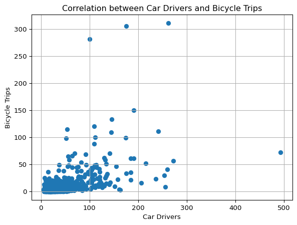

``` python
import matplotlib.pyplot as plt
import numpy as np
import pandas as pd

def read_od_matrix(file_path, n_rows):
    # reads the OD matrix from the CSV file
    od_matrix = pd.read_csv(file_path, nrows=n_rows, header=0)
    print(od_matrix)
    return od_matrix

def car_cycle_correlation(od_matrix):
    # plot car drivers as x and bicycle as y using matplotlib
    plt.scatter(od_matrix['car_driver'], od_matrix['bicycle'])
    plt.xlabel('Car Drivers')
    plt.ylabel('Bicycle Trips')
    plt.title('Correlation between Car Drivers and Bicycle Trips')
    plt.grid(True)

    #write to file
    plt.savefig('car_cycle_correlation.png')

import os

od_path = 'od.csv'
if not os.path.exists(od_path):
    od_path = 'data/od.csv'
    if not os.path.exists(od_path):
        od_path = 'https://github.com/itsleeds/ai4transport/raw/refs/heads/main/data/od.csv'
od_matrix= read_od_matrix(od_path, n_rows=1000)
car_cycle_correlation(od_matrix)
```

                 o          d  all  bicycle  foot  car_driver  train
    0    E02002985  E02002985  209        5   127          59      0
    1    E02002985  E02002987  121        7    35          62      0
    2    E02002985  E02003036   32        2     1          10      1
    3    E02002985  E02003043  141        1     2          56     17
    4    E02002985  E02003049   56        2     4          36      0
    ..         ...        ...  ...      ...   ...         ...    ...
    995  E02003046  E02003054  152        6    51          70      1
    996  E02003046  E02003056   42        2     0          32      0
    997  E02003046  E02003057   34        1     0          29      0
    998  E02003046  E02003058   38        1     2          28      1
    999  E02003046  E02003059   29        2     2          18      0

    [1000 rows x 7 columns]


